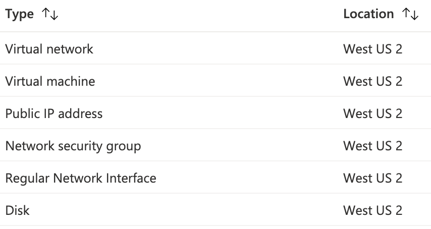

# Requirements
Společné požadavky:
- [x] vyber vhodne technologie a jazyka: Java/SpringBoot, Java, C#, … (povinné)
  - [Backend programming language](#backend-programming-language---java)
- [x] readme v gitu s popisem co je hotove a kde se funkcionalita nachazi (povinné)
- [x] vyuziti spolecne DB (relacni nebo grafova) (povinné)
  - [Database - PostgreSQL](#database---postgresql)
- [x] vyuziti cache (napriklad Hazelcast) (volitelné -2b pokud není)
  - [Cache - Redis](#cache---redis)
- [ ] vyuziti messaging principu (Kafka nebo JMS) (volitelné -2b pokud není)
- [x] aplikace bude zabezpecena pomoci bud basic authorization nebo pomoci OAuth2 (volitelné -2b
  pokud není)
  - [Authentication](#authentication)
- [x] vyuziti Inteceptors (alespon jedna trida) - napriklad na logovani (prijde request a zapiseme ho do
  logu) (volitelné -2b pokud není)
  - [Interceptors](#interceptors)
- [x] vyuziti jedne z technologie: SOAP, REST, graphQL, Java RMI, Corba, XML-RPC (volitelné -2b
  pokud není)
  - [REST](#rest)
- [x] nasazeni na produkcni server napriklad Heroku (povinné)
  - [Deployment](#deployment-tools-and-resources)
- [x] vyber vhodne architektury (event base, pipe and filter, …) (povinné)
  - [Architecture](#architecture)
- [x] inicializacni postup (jak aplikaci deploynout, kde jsou zakladni data do nove DB typu admin apod)
  (povinné)
  - [Initialization](#initialization-and-deployment)
- [ ] vyuziti elasticsearch (volitelné -2b pokud není)
- [x] pouziti alespon 5 design patternu (musi davat smysl :) ) (povinné)
- [ ] za kazdeho clena tymu 2 UC (use cases - aby SW nebyl trivialni) (povinné)

---

# Overview
The project's primary goal is to design and implement an application that would be able to collect data about universities from the annual QS World University Rankings, which are available at www.topuniversities.com. The application would provide an overview of the collected data and the analysis result through a suitable user interface.

---

# Technology
## Backend programming language - Java
The implementation of the BE application is done in the programming language Java version 17.  
[Java](https://www.amazon.com/Java-Language-Specification-SE-ebook/dp/B00K54BAO6) is a general-purpose, concurrent, class-based and object-oriented language.  
Java is chosen for the implementation of the application for its tooling, community support and previous experience with this language.
## Backend framework - Spring
In addition to the Java programming language, Spring Boot framework version 2.6.1 was used.  
Spring Boot has developed from another popular framework in the Java programming language world called Spring. [Spring](https://docs.spring.io/spring-framework/docs/5.0.0.RC2/spring-framework-reference/overview.html) was released two decades ago, in 2002, and with time evolved into a massive tooling set consisting of more than 20 different modules. Spring Boot Starter Web, JPA, Security, Validation, Actuator packages were used for implementation.
## Frontend programming language - TypeScript
The implementation of front end application for presentation and analysis of gathered data about universities is performed with TypeScript programming language.
> TypeScript is a strongly typed programming language that builds on JavaScript, giving you better tooling at any scale.
> 
> &mdash; [TypeScript documentation](https://www.typescriptlang.org/)

> TypeScript adds additional syntax to JavaScript, one of the most widespread cross-platform languages ever created. 
> 
> &mdash; [TypeScript documentation](https://www.typescriptlang.org/docs/handbook/intro.html)

TypeScript compiles into plain JavaScript which is supported by all major browsers. TypeScript was chosen for its popularity for development of web applications and similarity to Java programming language.

## Frontend core library - React
> React is a JavaScript library for building user interfaces.
> 
> &mdash; [ReactJS documentation](https://reactjs.org/docs/getting-started.html). 

As mentioned above, TypeScript compiles into JavaScript, which makes React and TypeScript a good combination of tools for development of front end applications. 
React was chosen as a core library to support implementation of the front end application for presentation and analysis of gathered data about universities.

## Database - PostgreSQL
[The PostgreSQL](https://www.postgresql.org/) database system is used for storing and retrieving scraped data. It is a popular object-relational database management system (ORDBMS), that is maintained as an open-source project. To work with the database in Java, the JDBC for PostgreSQL needs to be downloaded and configured. PostgreSQL was chosen for its performance, simplicity of use and other tools that improve developer experience, such as [pgAdmin](https://www.pgadmin.org/).
## Cache - Redis
[Redis](https://redis.io/) is used as a caching tool. [SpringBoot Cache](https://docs.spring.io/spring-framework/docs/5.1.8.RELEASE/spring-framework-reference/integration.html#cache) module is used for smooth integration Redis tool into the application.
## Microservices - Azure Functions
[Azure Functions](https://azure.microsoft.com/en-us/services/functions/) is used for creating microservices.
> Develop more efficiently with an event-driven, serverless compute platform that helps solve complex orchestration problems.
>
> &mdash; Azure Functions documentation

Communication between the main backend app and microservices is done with the help of HTTP. 

---

# Authentication

## Overview
Users authentication and authorization controller are located at `cz.cvut.fel.unirankings.common.controller.AuthController`. 
The registration and login data (username, password, etc.) is sent over HTTPS in the request body as plain text. 

## JWT
For authorization, I used JSON Web Token standard, [RFC 7519](https://datatracker.ietf.org/doc/html/rfc7519). 
After the user is logged in, a JWT is included in each subsequent client request. 
The creation and verification of JWT is implemented in `cz.cvut.fel.unirankings.common.security.jwt.JwtUtils`.

---
# Interceptors

I implemented HTTP interceptor in `cz.cvut.fel.unirankings.common.configuration.HttpRequestInterceptor`.  
This interceptor logs the start time when request comes to the server and then time taken when the response is returned.  
The interceptor is configured in `cz.cvut.fel.unirankings.common.configuration.InterceptorConfig`.

---

# REST
In my application, I implemented RESTful web API. 
REST resources and their URIs paths:
* THE University Rankings (`/the/universities`), 
* QS University Rankings (`/qs/universities`), 
* Jobs (`/jobs`).  

I leverage [Spring Web MVC](https://docs.spring.io/spring-framework/docs/5.0.0.M5/spring-framework-reference/html/mvc.html) framework to implement RESTful web services. 
I have annotated controller classes, e.g., `UniversityController` and `JobController`, that define the request mapping, authentication and authorization constraints, processing logic, etc.  

---

# Deployment tools and resources

## Backend - Azure Virtual Machines
For deployment of my backend application I rented virtual machine in [Azure Virtual Machines](https://azure.microsoft.com/en-us/services/virtual-machines/) service.

Virtual Machine specification:
* Location: West US 2
* Operating system: Linux (ubuntu 20.04)
* Size: Standard B2s (2 vcpus, 4 GiB memory)

I decide to use Azure Virtual Machines because it gives me more granular control over the operating system 
and ability to deploy multiple application on a single virtual server, 
such as PostgreSQL service + 2 docker containers for Redis and main app.

Ability to deploy multiple applications o na single host allows me to reduce costs for this project. 
In the production environment I would definitely not deploy database server and server application on a single virtual server. 

### Other resources on Azure

To use Azure Virtual Machine service I've also used the following services:


### Docker
I used [Docker](https://www.docker.com/) to be able to transparently deploy the backend application and related services on any server that supports Docker.
I have image configuration for main backend application located in `Dockerfile`. Then I use `docker-compose` to orchestrate all the containers. 
`docker-compose` uses `docker-compose.yml` as a configuration file. 

## Backend parsing service - Azure Functions

I used [Azure Functions](https://azure.microsoft.com/en-us/services/functions/) to deploy parsing service.
I followed [Create your first Java function in Azure using IntelliJ](https://docs.microsoft.com/en-us/azure/azure-functions/functions-create-maven-intellij) to deploy the app with IntelliJ and Azure Toolkit for IntelliJ extension.


## Frontend - Azure Static Web Apps
For deployment of my frontend application I used Azure Static Web Apps service. 
> Streamlined full-stack development from source code to global high availability
> 
> &mdash; Static Web Apps documentation

Azure Static Web Apps allows simple deployment and hosting of web application, including application written in Javascript or Typescript with frameworks, such as React, Vue.js, etc.
Because, I use React framework for my frontend application, I decided to use this service.

I use Free (For hobbies/personal projects) version of this service. Here is the [comparison](https://azure.microsoft.com/en-us/pricing/details/app-service/static/) of Free and Standard plans.

Thanks to [Azure Static Web Apps extension](https://marketplace.visualstudio.com/items?itemName=ms-azuretools.vscode-azurestaticwebapps) in Visual Studio Code, I managed to easily deploy the application.
This extension automatically configures the [GitHub Actions](https://github.com/features/actions) to deploy new changes to `master` branch. 
Automatically generated GitHub Actions definition can be found in `.github/workflows/` folder of the frontend project. 

---

# Design patterns

## Page Object Models
I used [Page Object models](https://www.selenium.dev/documentation/test_practices/encouraged/page_object_models/) for interaction with web applications that need to be scrapped.  
> “Page Object is a Design Pattern which has become popular in test automation for enhancing test maintenance and reducing code duplication.”
>
> &mdash; <cite>Selenium documentation</cite>

For each of the rankings, I created a page object model class that represents a page with list of rankings, e.g., `cz.cvut.fel.unirankings.times.pageobject.RankingsListPage` for Times Higher Education and  `cz.cvut.fel.unirankings.topuniversities.pageobjects.RankingsListPage` for TopUniversities.  
This pattern allows simpler unit testing, web page navigation and interaction.

## Abstract Factory pattern
I used something similar to Abstract Factory  design pattern for creation of object instances, that depend on the runtime arguments.  I read about this pattern [here](https://stackoverflow.com/questions/1943576/is-there-a-pattern-for-initializing-objects-created-via-a-di-container).  
Thanks to this pattern, I improve the testability of my classes, and, most importantly, my code operates with interfaces not the implementations.
Examples of pattern implementations are: `cz.cvut.fel.unirankings.topuniversities.pageobjects.IPageObjectFactory` and `cz.cvut.fel.unirankings.topuniversities.pageobjects.PageObjectFactory`
`cz.cvut.fel.unirankings.common.configuration.IBrowserFactory` and `cz.cvut.fel.unirankings.common.configuration.BrowserFactory`

## Singleton design pattern
Because I use Spring as core framework for implementation of my application, I also take advantage of the singleton design pattern.  
All the components, services, and repositories are created and added to Spring IoC container as singletons, because default bean scope in Spring is singleton.  

> Please be aware that Spring’s concept of a singleton bean is quite different from the Singleton pattern as defined in the seminal Gang of Four (GoF) patterns book. The GoF Singleton hard codes the scope of an object such that one and only one instance of a particular class will ever be created per ClassLoader. The scope of the Spring singleton is best described as per container and per bean.
> 
> &mdash; <cite>Spring framework documentation</cite>

## Template Method
I used Template Method design pattern when implementing parsers for rankings from different years, because the xPath to retrieve the desired value was different for different years.  
The implementation can be found in `cz.cvut.fel.unirankings.topuniversities.parsers.`
I used `AbstractRankingIndicatorParser`, that defines the overall structure of the scrapping process and then implemented `RankingIndicatorParser20142016`,  `RankingIndicatorParser20172019`, `RankingIndicatorParser20202022` with overridden methods for xPath.

## Facade
I used Facade design pattern to encapsulate the functionality of extraction, mapping anf storing data about universities.  
`QsExecutor` and `TheExecutor` classes are responsible for managing dependencies to extractor, mapper and database writers. They also provide simplified API for performing all three operations at once.

---

# Architecture

## Overview
I used client-server architecture, where client is represented by Javascript application that is run in user's browser and server is represented by Java application. 
The communication between client and server is done via HTTP requests and responses.

## Backend architecture
Backend consists of 4 core packages:
* `topuniversities` &mdash; responsible for extraction, storage and data retrieval of university rankings from [topuniversities.com](https://topuniversities.com).
* `times` &mdash; responsible for extraction, storage and data retrieval of university rankings from [timehighereducation.com](https://timehighereducation.com).
* `configuration` &mdash; responsible for jobs management. Job is a unit of work that represents user's requests for data extraction. 
* `common` &mdash; responsible for security, user management and application configuration.


### Decoupling into microservices 
Originally, backend was designed as a monolith. Later it was decoupled into microservices to reduce complexity and improve scalability.
For example, the parsing part for Times Higher Education was extracted into a separate application that is deployed to [Azure Functions](https://azure.microsoft.com/en-us/services/functions/).

---

# Initialization and Deployment

## Demo user
Admin user credentials:
* Username: `admin`
* Password: `Nss2022Password`

## Demo database
Embedded H2 database is used for demo purposes. It is initialized with test user, test data for TopUniversities and Times Higher Education.

## Deploy locally

### Prerequisites
* JDK 17
```
openjdk 17.0.3 2022-04-19
OpenJDK Runtime Environment Homebrew (build 17.0.3+0)
OpenJDK 64-Bit Server VM Homebrew (build 17.0.3+0, mixed mode, sharing)
```
* Maven 3.8.1
* Docker version 20.10.14
* docker-compose version 1.29.2
* An internet access for installing Maven dependencies and reaching to Azure Functions.

### Commands
```shell
mvn clean package
docker-compose up cache
java -jar ./target/UniversitiesRankings-1.0-SNAPSHOT.jar --spring.profiles.active=demo
```
